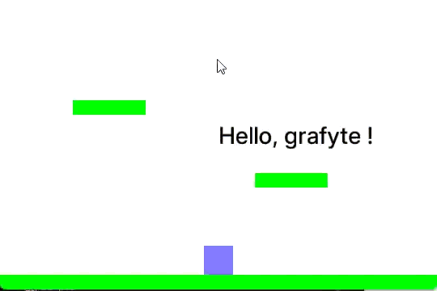

# Grafyte

Grafyte is a lightweight and simple 2D game engine written in C++ with OpenGL and exposed to Python using pybind11. It
aims to provide a fast and easy-to-use interface for creating 2D games and interactive applications.

## Features

- **Simple API**: Designed for ease of use with a straightforward Pythonic interface.
- **Fast Rendering**: Core engine written in C++ utilizing OpenGL.
- **2D Sprites**: Support for textures and colored objects.
- **Text Rendering**: Easy text display with scale and color control.
- **Simple Collision System**: Integrated AABB-based collision detection with automatic resolution.
- **Input Management**: Easy-to-use action-based input system with support for keyboard triggers (Press, Hold, Release).
- **Scene-based Workflow**: Manage game objects within scenes.

## Installation

To install grafyte , simply run the following command in your terminal:

```bash
python -m pip install grafyte
```

## Building from Source

### Prerequisites

- Python 3.10+
- A C++ compiler (MSVC, GCC, or Clang)
- CMake
- OpenGL drivers

> [!NOTE]
> When applicable, please make sure to test your code on both windows and linux as well as on Python 3.10 **to** 3.14 if
> possible.

### Build

To set up the development environment and build Grafyte:

**Windows:**

```powershell
scripts\setup.bat
.\.venv\Scripts\activate
pip install .
```

**Linux:**

```bash
chmod +x scripts/setup.sh
./scripts/setup.sh
source .venv/bin/activate
pip install .
```

Finally, you can build the python extension using CMake:

```bash
mkdir build
cd build
cmake ..
cmake --build .
```

## Quick Start

Here's a minimal example to get you started:

```python
import grafyte
from grafyte import Key, InputTrigger

# Initialize application
app = grafyte.Application("My Game", (800, 600))
scene = app.make_new_scene()

# Create a player object
player = scene.spawn_object((0, 0), (50, 50))
player.color = (0, 255, 0), 1.0

# Register an action
app.input.create_action("move_right", InputTrigger.Hold, Key.D)

while not app.should_close():
    dt = app.get_delta_time()

    # Handle input
    if app.input["move_right"]:
        player.pos.x += 100 * dt

    # Render scene
    app.render()

app.quit()
```

For further information, please refer to the full documentation on [readthedocs.io](https://grafyte.readthedocs.io)

### Demo

Here is another example of a game made using only grafyte:


## License

Grafyte is licensed under the MIT License – see the [LICENSE](LICENSE) file for details.
